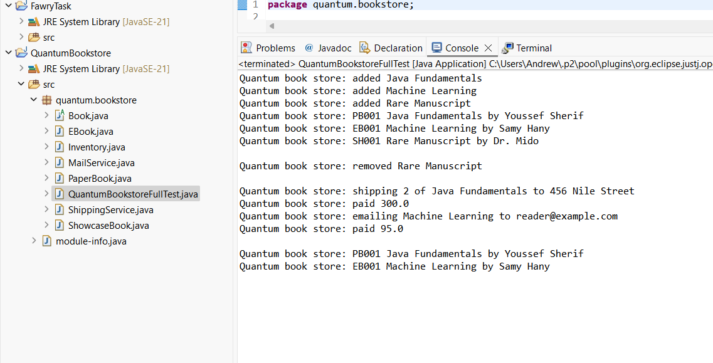
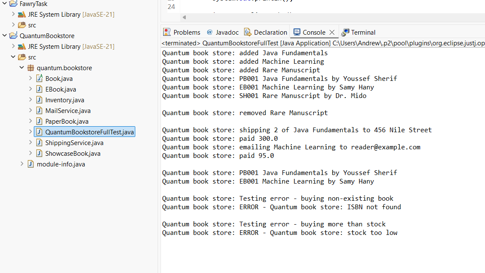

# fawry-challenge-2-bookstore

This was created as a Java assignment on Fawry Challenge 2. It's a simple bookstore system that can add, remove, and buy various book types via a system on a console.

## Project Description

The program runs on three classes of book: shippable paper book, emailable eBook, and demonstration showcase book that cannot sell. It deals with common inventory procedures and covers edge cases such as stock constraints and invalid ISBNs.

These are all prepended by "Quantum book store" as a requirement.

## Features

An

- Add to inventory (ISBN, title, year, price, author)
- Remove outdated texts after a specified time interval
- Purchasing books by ISBN, quantity, email, and address
- Three book classifications:
-PaperBook: in stock, shipped by ShippingService
- EBook: no stock restriction, delivred via MailService
- ShowcaseBook: It's a view-only book,
- Error handling for:
- Invalid ISBN
- Buying extra supplies than are available

- Buying a book you can resell
## Screenshots

### 1. Full output including error handling

This screenshot shows the full execution of the program, including adding books, removing outdated entries, purchasing, and error handling for out-of-stock and invalid ISBN cases.

### 2. Clean output without errors

This screenshot shows normal output for adding books and successful purchases, without triggering any errors.

